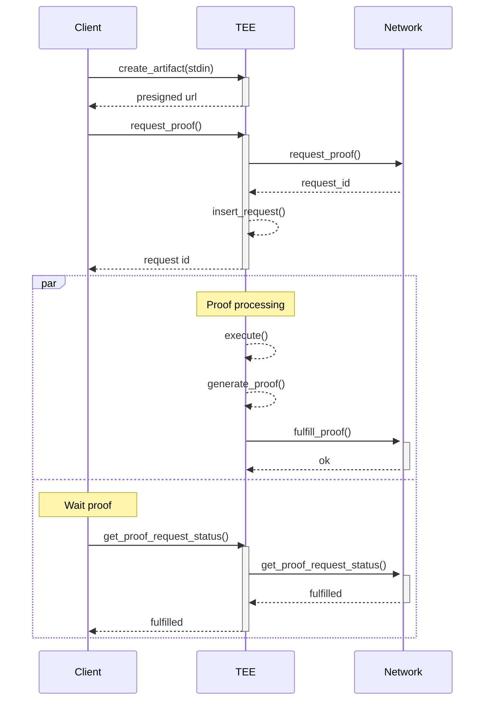

## SP1 Private Proving

### Overview

This repository address the use case when customers wants fast proofs generation (on GPUs), but can't use a prover network because the proof inputs need to be private.

The repository is organized in 2 binaries, both designed to run inside a TEE:

* `server`: Acts as a proxy to the Succinct Prover Network, accepting proof requests from the SP1 SDK.
* `fulfiller`: Handle proving tasks and report proof requests status change to the Prover Network.

The TEE infra rely on [Phala cloud] and [dstack], and proving is done with [SP1].

To enable private proving with the SP1 SDK, you just need to call the [`private()`] fn on [`NetworkProverBuilder`]:

```rust
let client = ProverClient::builder()
    .network()
    .private()
    .build();
```

This will update the network prover client to send proof requests to a TEE application (via the tee.sp1-lumiere.xyz domain) instead of sending them to the [Prover Network], allowing the proof inputs to remain private.

### How It Works

When enabling TEE Private Proving, the proof requests are not sent to the Succinct Private Network infra, but instead to a TEE application (hosted at tee.sp1-lumiere.xyz). The tee.sp1-lumiere.xyz TLS certificates are managed by the TEE application itself, allowing proof inputs to remain private.

The workflow is the following:



1. The client app create a proof request using the SP1 SDK.
   * The proof request is sent to the TEE, and is proxied to the Network
   * A presigned URL is sent to the client to store the program in S3
   * Another presigned URL is sent to the client to store the proof inputs in the TEE
2. The proof is generated inside the TEE
   * The program is downloaded from S3
   * The proof inputs are already in the TEE
   * The program is first executed, and then the proof is generated
   * When the proof is generated, The TEE update the proof request status on the Network
   * The proof is sent to the Network that store it to S3
3. Meanwhile, the client app sends requests to the TEE, querying the proof request status
   * The status requests are proxied to the Network
   * When the proof request is fulfilled, it's downloaded from S3 and provided to the user


We can see from the workflow above that the proof inputs are directly sent to the TEE, keeping them private. Also, the proof is generated inside the TEE.

### TLS Certificates Verification

In order to ensure the communications to the TEE enclaves are secure, the tee.sp1-lumiere.xyz domain certificates must be managed by the TEE application itself. This is achieved by the Phala [Zero Trust TLS] protocol.

Anyone can easily verify that only the TEE controls the certificate, by following these steps:

#### Step 1: Get the Evidence Files

```bash
# Download the evidence files (4 files total)
curl -sO https://tee.sp1-lumiere.xyz/evidences/quote.json
curl -sO https://tee.sp1-lumiere.xyz/evidences/sha256sum.txt
curl -sO https://tee.sp1-lumiere.xyz/evidences/cert.pem
curl -sO https://tee.sp1-lumiere.xyz/evidences/acme-account.json

# Verify the files haven't been tampered with
sha256sum -c sha256sum.txt
```

Expected output:

```bash
acme-account.json: OK
cert.pem: OK
```

This means the files are authentic.

#### Step 2: Verify the Certificate Matches

Check that the evidence matches what’s actually being served:

```bash
# Compare the served certificate with the evidence certificate
echo | openssl s_client -connect tee.sp1-lumiere.xyz:443 2>/dev/null | \
  openssl x509 -fingerprint -sha256 -noout
openssl x509 -in cert.pem -fingerprint -sha256 -noout
```

Both fingerprints should be identical.

Now verify the TEE hardware signed these files:

```bash
# 1. Get the hash of sha256sum.txt
sha256sum sha256sum.txt
# Output: 3613a4229d6ac5a0f41829863abfffd09e5aed3d5db2816b294a8244ad34c096  sha256sum.txt

# 2. Search for this complete hash in the TDX quote
cat quote.json | jq -r '.quote' | grep -o "3613a4229d6ac5a0f41829863abfffd09e5aed3d5db2816b294a8244ad34c096"
# Output: 3613a4229d6ac5a0f41829863abfffd09e5aed3d5db2816b294a8244ad34c096
```

What this means: If you see the same 64-character hash in both outputs, Intel TDX hardware has cryptographically signed your evidence files. Copy the hash from 1. and search for it in 2. - they must match exactly.

#### Step 3: Check Domain Protection

Make sure only this TEE can get certificates for your domain:

```bash
# Get the TEE's ACME account number
cat acme-account.json | jq -r '.uri'

# Check if the domain is locked to this account
dig +short CAA tee.sp1-lumiere.xyz
```

The ACME account should match in the 2 commands above.

When all verifications pass, you’ve proven that only this specific TEE instance has the private key for the TLS certificate, and that the CAA DNS records prevent anyone else (even with domain access) from issuing certificates.

### Application Integrity Verification

Phala also provides mechanisms for anyone to verify that an application is running inside a genuine, secure TEE with the expected configuration and code, with Remote Attestation. You can learn more about it on the [Understanding Attestation] page in the Phala Cloud documentation.

To verify that the code running inside the TEE application at tee.sp1-lumiere.xyz correspond to the code published in this repo, follow these steps:


1. Clone the repository
   ```bash
   git clone https://github.com/succinctlabs/sp1-tee-private-proving.git
   cd sp1-tee-private-proving
   ```

2. Build the Docker images for the server and the fulfiller
   ```bash
   just build-docker-images
   ```

3. Display the Docker `server` and `fulfiller` images digests:
   ```bash
   just show-digests
   ```

4. Verify the digests correspond to the ones used in the `docker-compose.yml` file at the root path of this repo

5. Retrieve the known [RTMR3] of the TEE application from the Phala Cloud API:
   ```bash
   just get-attestation
   ```

6. Compute the RTMR3 using the [RTMR3 Calculator], using the following values: 
   * The `docker-compose.yml` file is the one you verified at step 4
   * The appId is `9b78cf840e16a8274e00474cdac4afdabc5eeb93`
   * The InstanceId is `f15edb2cc265a06a7cb524d0022bb13277eb177c`

If both `RTMR3`s at step 5 and 6 are identical, you’ve proven that the `docker-compose.yml` file used to create the TEE Application is the same as the one in this rep, and contains the exact Docker images you built.


[`private()`]: https://docs.rs/sp1-sdk/latest/sp1_sdk/network/builder/struct.NetworkProverBuilder.html#method.private
[`NetworkProverBuilder`]: https://docs.rs/sp1-sdk/latest/sp1_sdk/network/builder/struct.NetworkProverBuilder.html
[Prover Network]: https://docs.succinct.xyz/docs/sp1/prover-network/quickstart
[SP1]: https://docs.succinct.xyz/docs/sp1/introduction
[Phala cloud]: https://docs.phala.com/phala-cloud/what-is/what-is-phala-cloud
[dstack]: https://github.com/Dstack-TEE/dstack
[Zero Trust TLS]: https://docs.phala.com/dstack/design-documents/whitepaper#zero-trust-tls-protocol
[Domain Attestation]: https://docs.phala.com/phala-cloud/networking/domain-attestation#custom-domains-zero-trust-verification
[Understanding Attestation]: https://docs.phala.com/phala-cloud/attestation/overview#introduction
[RTMR3]: https://docs.phala.com/phala-cloud/attestation/overview#rtmr3-event-chain%3A-how-application-components-are-measured
[RTMR3 Calculator]: https://rtmr3-calculator.vercel.app/
[dstack-verifier]: https://github.com/Phala-Network/dstack-verifier
